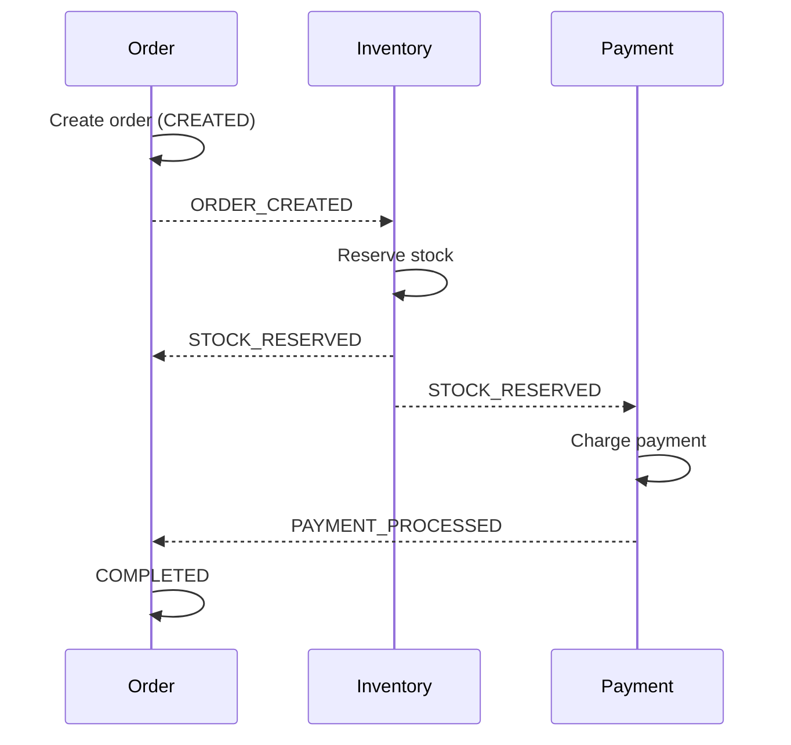
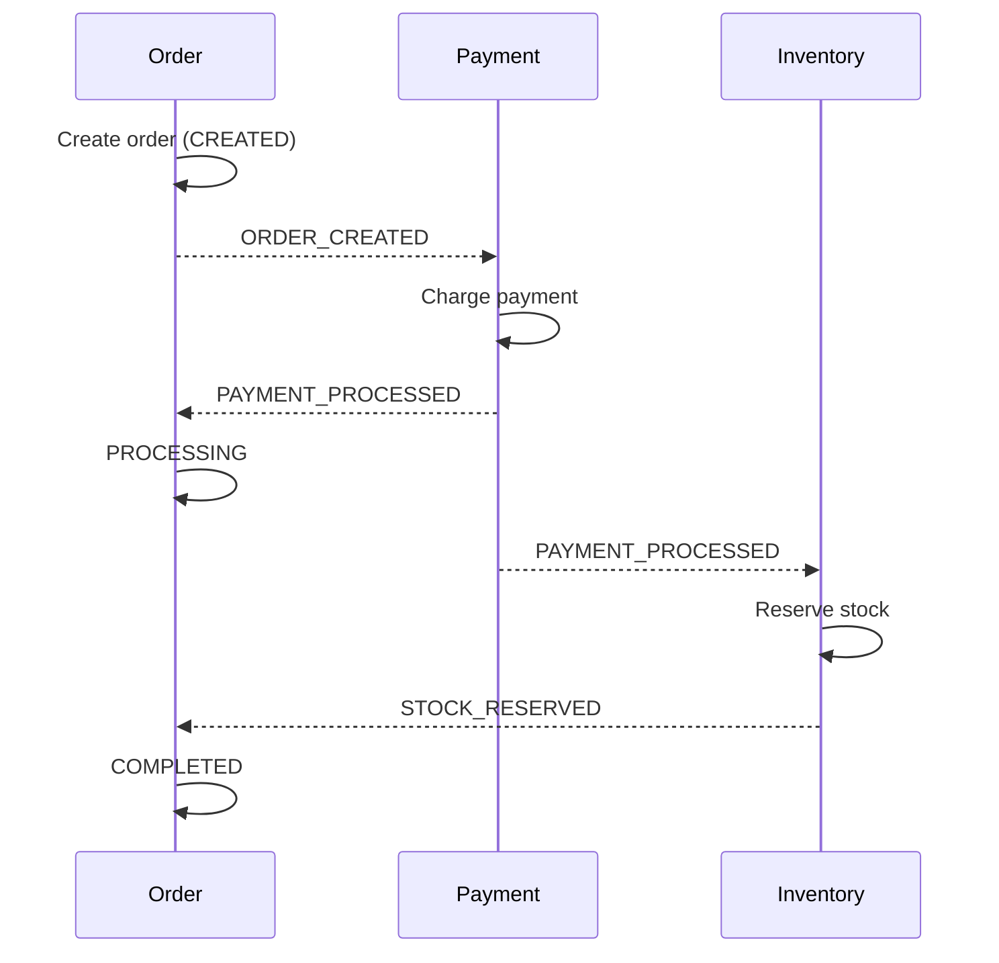
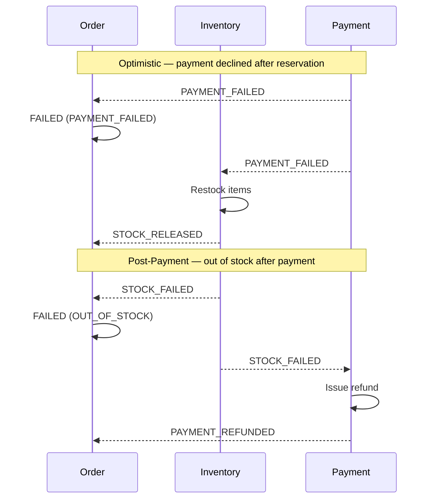
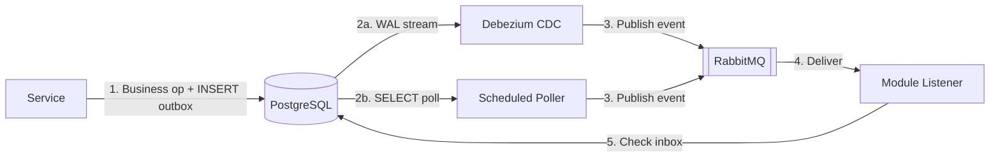
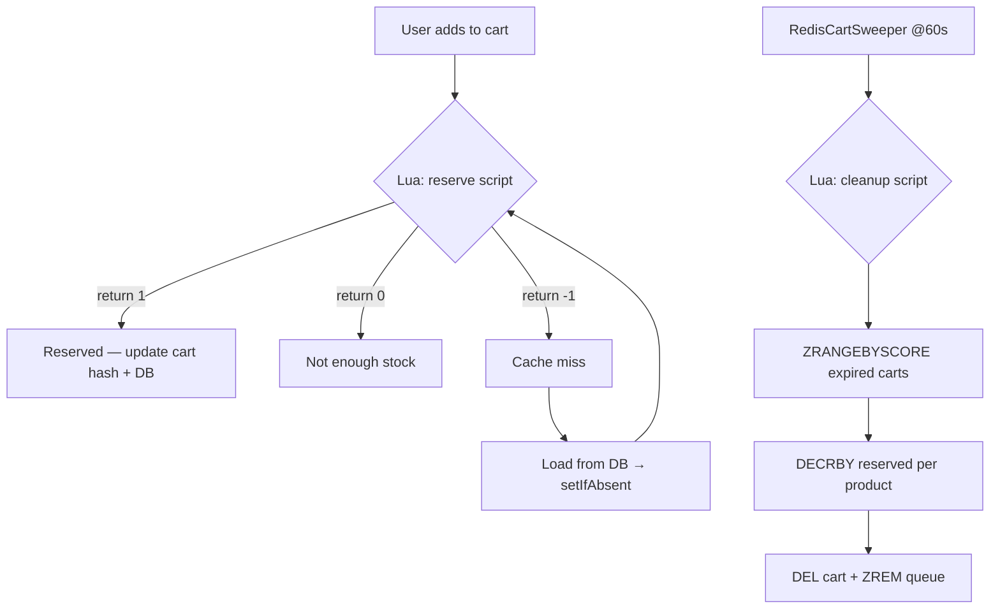
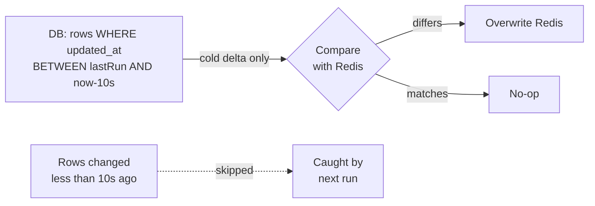

# Checkout Pulse — E-Commerce Distributed Systems Playground

A backend application modelling a distributed e-commerce checkout process.
The project uses a package-level modular monolith approach to implement event-driven saga choreography, CDC-based reliable messaging, and concurrency control — all inside a single Spring Boot deployable.

## Tech Stack

| Layer | Technology |
|-------|-----------|
| Language & Framework | **Java 25**, **Spring Boot 4.0.3** |
| Persistence | **PostgreSQL** (per-module schemas), **Flyway** migrations |
| Messaging | **RabbitMQ** (topic exchange, per-module queues) |
| Caching & Reservations | **Redis** (stock cache, cart, sorted-set TTL queue, Lua scripts) |
| Change Data Capture | **Debezium Embedded Engine** (PostgreSQL WAL → RabbitMQ, default outbox publisher) |
| API Docs | **springdoc-openapi 3.0.1** (Swagger UI) |
| Testing | **Testcontainers** (Postgres, RabbitMQ, Redis), **JUnit 5**, **AssertJ** |

## Architecture & Workflows

### 1. Saga Choreography (Decentralized)

Each module reacts to domain events without a central orchestrator.
The exact event routing changes per checkout strategy — RabbitMQ bindings are swapped via Spring `@Profile`:

**Optimistic Strategy** (`@Profile("optimistic")`) — reserve stock first, then charge:



**Post-Payment Strategy** (`@Profile("post-payment")`) — charge first, then attempt reservation:



**Compensation flows:**



### 2. Reliable Messaging — Shared Outbox + Per-Module Inbox

All domain services write events into a **single `shared.outbox` table** inside the same DB transaction as the business operation.



Two publisher modes are available, switched via `outbox.mode`:

* **`cdc` (default):** `DebeziumOutboxPublisher` — an embedded Debezium engine that tails the PostgreSQL WAL (`pgoutput` plugin), captures INSERTs into `shared.outbox`, publishes each event to RabbitMQ, and deletes the processed row. Near-real-time, no polling delay.
* **`polling`:** `ScheduledOutboxPublisher` — a `@Scheduled` task that reads the outbox every 5 seconds and pushes to RabbitMQ.

Each module (Order, Inventory, Payment, OrderView, RedisStock) maintains its own **inbox table** keyed by `event_id`, guaranteeing **exactly-once** processing at the consumer level. Listeners check the inbox before handling any event.

### 3. Redis Lua Scripts for Atomic Stock Reservation

Stock availability lives in Redis as `stock:{productId}` / `reserved:{productId}` keys.



Two Lua scripts run atomically to prevent race conditions:

* **`redis-reserve-stocks-script.lua`** — called when a user adds an item to the cart.
  Checks `(stock - reserved) >= qty`, and if so atomically `INCRBY reserved`. Returns `-1` on cache miss (triggers DB fallback + retry), `0` on insufficient stock, `1` on success.

* **`redis-remove-expired-reserves-script.lua`** — called by `RedisCartSweeper` every 60s.
  Reads a `ZRANGEBYSCORE` on `cart:cleanup:queue` for expired entries, iterates each cart hash, decrements the corresponding `reserved:` keys, then deletes the cart and removes it from the sorted set.

### 4. Idempotency & Concurrency

Order creation is protected at two levels:

1. **Redis SETNX lock** on `lock:{idempotencyKey}` with a 10s TTL — blocks duplicate HTTP requests.
2. **DB `IdempotencyRecord`** — persisted in the same transaction as the order. If a record with `COMPLETED` status already exists, the cached response is returned.

Inventory mutations use JPA **`@Version` optimistic locking** with `@Retryable` (up to 2 retries, 100ms delay) to handle concurrent reservations without distributed locks.

### 5. CQRS Read Model — Order View Projection

`OrderProjectionHandler` listens for `ORDER_UPDATED` events and maintains an `OrderView` table with a computed `displayStatus` (e.g. `PROCESSING`, `COMPLETED`, `AWAITING_PAYMENT`, `REFUND_IN_PROGRESS`). The projection has its own inbox (`OrderViewInbox`) for deduplication.

### 6. Redis ↔ DB Reconciliation

The same data lives in two places: Redis (fast cache that serves reads) and PostgreSQL (source of truth). Every operation writes to both, so they stay in sync under normal conditions. But edge cases can cause drift: app crash between a Redis write and a DB commit, Redis restart losing all keys, a missed event, or the cart sweeper cleaning Redis but not DB.

A scheduled `ReconciliationService` runs **every 5 minutes** and corrects three data pairs — `stock:{pid}`, `reserved:{pid}`, and `cart:{userId}` — by comparing Redis with DB and overwriting Redis when they differ.

**Why not just `findAll()`?** A naive full-scan every 5 minutes kills the DB at scale, and has a race condition: if a user just added an item, Redis is already updated (Lua), but the DB transaction hasn't committed yet — reconciliation would read the old DB value and overwrite the correct Redis value.

Instead, a **timestamp-based delta with cooldown** is used:



* **Delta queries** — entities have `@UpdateTimestamp updatedAt`; only rows modified since the last run are fetched, not the entire catalog.
* **Cooldown window (10s)** — records modified in the last 10 seconds are skipped because the DB transaction may still be in flight. The next run picks them up once they're "cold".
* **First run after restart** — `lastRunAt = EPOCH`, so everything is checked once (equivalent to a one-time full scan), then only deltas going forward.
* PostgreSQL is always the source of truth. Every correction is logged as a WARN for observability.

### 7. Rich Domain Model

Domain entities encapsulate business rules and state transitions:

* **`Order`** — factory method `Order.create()`, guards like `addItem()` only in `CREATED` state, self-driven transitions (`recordPaymentSuccess()`, `recordInventoryFailed()`, etc.), automatic `checkIfFinished()` when both payment and inventory succeed.
* **`InventoryItem`** — `reserve()` / `restock()` with built-in validation.
* **`Cart`** — `updateOrAddItem()` with upsert semantics, `clear()` on checkout.

## Project Structure

```
com.seregamazur.pulse
├── cart/          Redis + DB shopping cart, CartService with Lua reservation
├── config/        RabbitMQ topology, Redis templates, strategy-specific bindings
├── infra/         RedisStockProvider, RedisCartSweeper, RedisStock inbox
├── inventory/     InventoryItem, InventoryService (reserve/restock), Product
├── order/         Order aggregate, OrderService, OrderController, CQRS views
├── payment/       Payment entity, PaymentService (pay/refund)
└── shared/        Domain events, EventEnvelope, Outbox entity + CDC/polling publishers
```

## Running Locally

```bash
# Start infrastructure
docker compose -f docker/compose.yaml up -d

# Run the app (defaults to CDC outbox mode)
./mvnw spring-boot:run

# Or with polling outbox mode
./mvnw spring-boot:run -Dspring-boot.run.arguments="--outbox.mode=polling"
```

## Testing

```bash
# All integration tests (Testcontainers auto-start Postgres, RabbitMQ, Redis)
./mvnw clean test
```